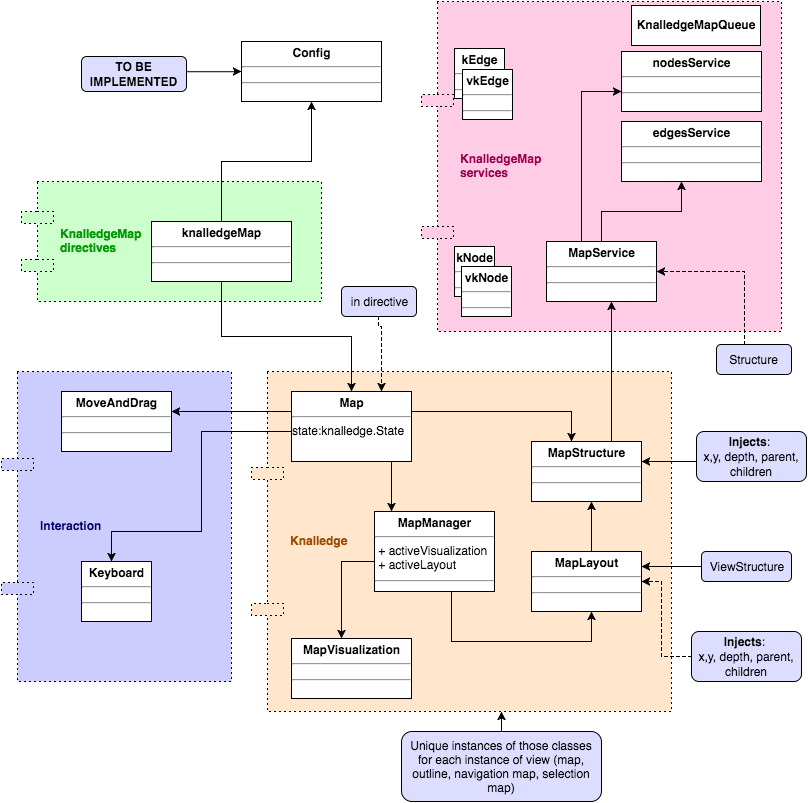

# Building Process

The majority of server and client components are built on **MEAN stack** so the environment necessary for starting tool should be straightforward.

## Server
Server is at the moment completely built as **node.js** environment. Therefore you need node and npm tools installed to run it properly. When you have them installed all you need to do is to install necessary packages with

    npm install

    npm install --production

    sudo npm install node-gyp -g
    sudo npm cache clean
    rm -rf node_modules

    sudo npm install npm -g
    sudo npm install gulp -g
    sudo npm i typings -g
    sudo npm install -g typescript
    sudo npm install ts-node -g
    sudo npm install typescript-node -g
    sudo npm install node-gyp -g
    sudo npm install marked -g


# TypeScript

sudo npm install -g ts-node
sudo npm install -g typescript
rm -r typings
npm run postinstall

Precompile tools at one machine
`tsc`
copy them to Sinisha's machine

## Typings
  typings install open --ambient --save
  typings install merge-stream --ambient --save

  typings install
  https://github.com/DefinitelyTyped/DefinitelyTyped/blob/ffceea9dd124d277c4597c7bd12930666ec074c5/open/open.d.ts
  "open": "github:DefinitelyTyped/DefinitelyTyped/open/open.d.ts#ffceea9dd124d277c4597c7bd12930666ec074c5"
  src/frontend/typings.json

```js
declare module 'open' {
	function open(target: string, app?: string): void;
	export = open;
}
```

```js
declare module open {
	export function open(target: string, app?: string): void;
}

declare module "open" {
	export = open;
}
```

```sh
// Generated by typings
// Source: https://raw.githubusercontent.com/DefinitelyTyped/DefinitelyTyped/dc2c61c4b295d88befeba7fa542582d0e8ec85dc/merge-stream/merge-stream.d.ts
// Type definitions for merge-stream
// Project: https://github.com/grncdr/merge-stream
// Definitions by: Keita Kagurazaka <https://github.com/k-kagurazaka>
// Definitions: https://github.com/borisyankov/DefinitelyTyped


declare module MergeStream {

    interface IMergedStream extends NodeJS.ReadWriteStream {
        add: (source: NodeJS.ReadableStream) => IMergedStream;
    }

    function merge<T extends NodeJS.ReadableStream>(...streams: T[]): IMergedStream;
    export = merge;
}

declare module "merge-stream" {
	export = MergeStream;
}
```

```sh
npm WARN enoent ENOENT: no such file or directory, open '/Users/sir/Documents/data/Development/KnAllEdge/src/backend/node_modules/v8-debug/package.json'
npm ERR! Darwin 15.3.0
npm ERR! argv "/usr/local/bin/node" "/usr/local/bin/npm" "install" "--dev"
npm ERR! node v5.8.0
npm ERR! npm  v3.8.0
npm ERR! path /Users/sir/Documents/data/Development/KnAllEdge/src/backend/node_modules/.staging/npmlog-57f83870
npm ERR! code ENOENT
npm ERR! errno -2
npm ERR! syscall rename

npm ERR! enoent ENOENT: no such file or directory, rename '/Users/sir/Documents/data/Development/KnAllEdge/src/backend/node_modules/.staging/npmlog-57f83870' -> '/Users/sir/Documents/data/Development/KnAllEdge/src/backend/node_modules/node-inspector/node_modules/v8-debug/node_modules/node-pre-gyp/node_modules/npmlog'
npm ERR! enoent ENOENT: no such file or directory, rename '/Users/sir/Documents/data/Development/KnAllEdge/src/backend/node_modules/.staging/npmlog-57f83870' -> '/Users/sir/Documents/data/Development/KnAllEdge/src/backend/node_modules/node-inspector/node_modules/v8-debug/node_modules/node-pre-gyp/node_modules/npmlog'
npm ERR! enoent This is most likely not a problem with npm itself
npm ERR! enoent and is related to npm not being able to find a file.
npm ERR! enoent
```

**NOTE**: Backend needs a special ```express-resource``` package on steroids. You can download it as a separate package [here](http://magicheads.info/downloads/express-resource.zip). After or even before issuing ```npm install``` you should (re)place the content of the archive:

in your ```backend/node_modules``` folder

then you should go to 2. in ```backend/modules/topiChat```
and do npm install there

and (re)start the server

    npm start

## MongoDB

Default MongoDB installation should be good enough. The mongo database must be running before starting the server.

# Running the backend

When you want to run the server you need to run specific ```package.json``` command: start. You do it by running:

npm start

Server will start, connect to default mongodb port and start listening for client connections on the announced port.

## Client



Client is implemented at the moment as a ng1/2 hybrid (Angular1/Angular2). Angular

### Debugging support

Debugging is handled with the support of the [debugpp](https://www.npmjs.com/package/debugpp) and [debug](https://www.npmjs.com/package/debug) libraries. Therefore in the browser console you need to enable debugging in order to see it:

This is how you would globally enable debugging:
```js
localStorage.debug = '*';
```

or just for particular namespace (and all subspaces)
```js
localStorage.debug = 'knalledge.collaboPluginsServices.*';
```

or just for the semantic-subspace (`error` in this case) of a for particular namespace:
```js
localStorage.debug = 'knalledge.collaboPluginsServices.*.error';
```

### Development deployment

#### server
Anything that should be served OUT of the dist/dev folder, should be mapped in the server config to be available: `src/frontend/tools/utils/code_change_tools.ts`

This is how we have enabled `bower_components` and images:

```js
let routes:any = {
  ...
  '/bower_components': 'bower_components',
  '/app/images': 'app/images'
};

```

### DefinitelyTyped conflicts

jQuery and Protractor (Seleinum) both use the same global variable: ```$```. There fore TypeScript compiler complains:

    ⨯ Unable to compile TypeScript

    typings/main/ambient/jquery/jquery.d.ts (3212,13): Subsequent variable declarations must have the same type.  Variable '$' must be of type 'cssSelectorHelper', but here has type 'JQueryStatic'. (2403)

At the moment there is no simple solution except remove it from some of the tools, etc.
We did remove it manually:

Here are
