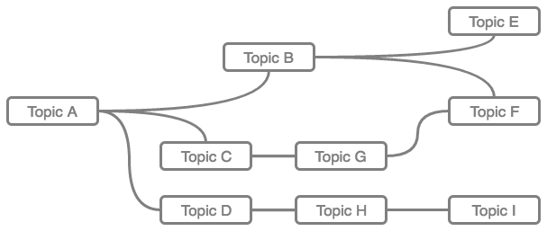
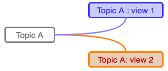
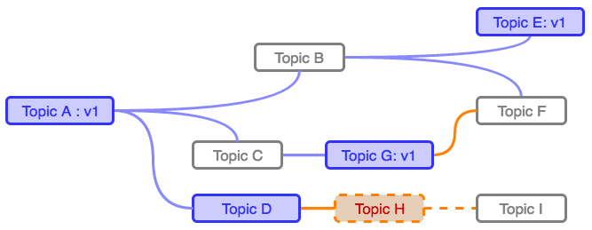
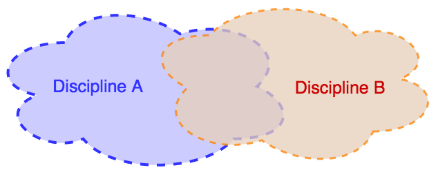
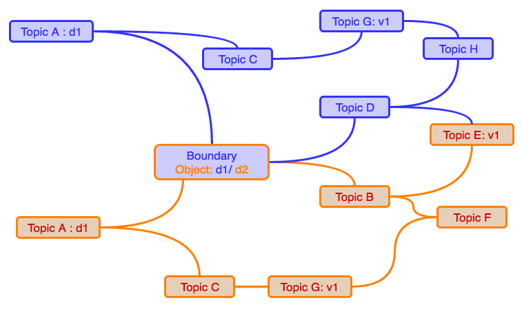

# KnAllEdge

__KnAllEdge__ is a general knowledge layer, that can serve as a separate knowledge mapping service (please @see [KnAllEdge Homepage]{@link http://cf.colabo.space}), but it also serves as an underlying layer for the __CollaboScience__ ecosystem (@see [CollaboSceince Homepage]{@link http://www.collaboscience.com}).

**Figure 1**: KnAllEdge example - Modeling the open table dialogue on the topic of the Tesla's Nature of Creativity at the Tesla Conference (2015)

Some of the main motivations behind developing KnAllEdge are the following:

* support of collective "knowledge-gardening" (thanks to Jack Park for the term)
* create a semantic-agnostic knowledge model
* create a universal knowledge layer with zero-friction between SoA system components
* create extendable knowledge semantics
* support dialogical process of knowledge creation
* support multi-truth knowledge
* support fuzzy-knowledge
* support personalized knowledge

An outmost goal was succeeding in development of the collaborative-system with unobtrusive and continuous **knowledge-dialogue-decision-action-learn** cycle:

**Figure 2**: CollaboScience spiral

KnAllEdge is inspired with __ISO__ standard (ISO/IEC 13250:2003) of Mind-maps: **Topic maps** (@see on [Wikipedia]{@link https://en.wikipedia.org/wiki/Topic_Maps}) and __SocioTM__ (please @see [abstract]{@link http://tmra.de/2008/talks/socioTM-relevancies-collaboration-and-socio-knowledge-in-topic-maps.html} and [paper]{@link http://tmra.de/2008/talks/pdf/309-323.pdf}).

## Product

[www.**KnAllEdge**.org]{@link http://cf.colabo.space} is a product running on the top of the KnAllEdge service, and provides intuitive interface to the KnAllEdge.

# Semantic plugins

## RIMA

[RIMA service] (rima.collaboscience.com)
[RIMA draft discussion] (https://docs.google.com/document/d/1krMfz7G0iFgNc538tzblAwOov2w2JXvoit_UPhndL1Q/edit?usp=sharing)

## Multi-truth

**Figure 3**: KnAllEdge - a set of related topics

### Poliscopy

**Figure 4**: Poloscopy - multiple alternatives/perspectives/views

+ Some facts/truths have multiple alternatives/perspectives/views
	+ religion
	+ morality
	+ duality of matter and light
	+ ...
+ We need to support providing multiple "dimensions" or knowledge representations of the same fact/topic/node.
+ We also need to provide multiple projections of the ***"truth-branch"***
	+ all nodes that polyscopic or do exist only in some scope, must transform / appear / disappear according to chosen scope of the truth

**Figure 5**: Poloscopy - multiple alternatives/perspectives/views

### Truth-evolution
+ truth might not be known, and we might let community to provide multiple truths until it evolves into the right one
+ we need to provide discussion before merging into one truth
	+ discussion should be ortogonal to knowledge

## Boundary-objects

+ How to talk across discipliness

**Figure 6**: Transdisciplinarity

+ trans-disciplinarity
+ multi-definitions
+ connecting different topics and unites them
+ long- and trans-disciplinary- leaps for discovering topics, ideas, ...

**Figure 6**: Boundary objects

## Fuzziness

+ Support distance between topics
+ Support bidirectionality, different distances between topics

## SocioTM / Personalization

+ How each person can ***"see"*** her/his own truth?

## Hierarchy

+ Support relationship between entities
	+ TopicMap's support generalization

## Semantical suggar

+ TopicMap's support specialized semantic
+ some standards provide as well

## IBIS

@see [IBIS plugin] (ibis.collaboscience.com)

### Conceptual difference from standard implementations of IBIS

**IBIS module** implemented on the top of KnAllEdge differs from the standard implementation of IBIS (please @see for the reference: )[reference to IBIS] ).

The main reason for diverging from the original IBIS implementation is that original IBIS system(s) are designed as an independent systems that provides dialogue mapping. CollaboScience promotes frictionless services integration and knowledge sharing among the services.

The fundamental problem with the most of standards IBIS implementation is that although if they were intended to support ***dialogue mapping*** around different topic of interests of a community, naturally the process of argumentative dialogue necessarily introduce new knowledge artifacts which transforms semantically clean IBIS space into space cognitively polluted with knowledge. This in addition to confusion at information level brings confusion at the level of community procedures (i.e. where to search for knowledge, or what is the consensus status regarding some topic, etc.). It also introduce additional ***articulation work*** of managing knowledge products and migrating it into a knowledge repository, or updating the repository based on the agreed census.

Obviously, this is not the wanted scenario, which brings us to integrate IBIS differently in the CollaboScience ecosystem.

First of all, IBIS (Issue Based Information System) loses its status of an information system, and it becomes a *component* that deals with particular knowledge-transformation procedures.

Secondly, IBIS is integrated with regular knowledge, and represented with regular KnAllEdge artifacts. However, IBIS is still both ***semantically and procedurally isolated*** from the regular knowledge.

### Practices of using IBIS in the KnAllEdge / CollaboScience

Here we present some of more structured practices of using IBIS plugin inside the CollaboScience ecosystem.

#### IBIS as a knowledge consensus mechanism

The most clear example is a scenario where knowledge workers do not have a consensus on a particular topic or are lacking enough insights on the topic.

In this scenario, a member of the community that recognizes a problem will "***burst***" an instance of a dialogue mapped through the IBIS component addressing particular topic of knowledge.

In that sense, discussion is orthogonal (isolated with unique semantic ***"%IBIS.*" namespace***) to the regular knowledge space. After consensus or required level of insights are collected in the IBIS space, the insights/consensus is "***contracted back***" to (it updates back to) the knowledge-space.

#### IBIS as knowledge multi(-truth/-opinion) polarization and argumentation

It is very often the case that some pieces of knowledge cannot be expressed either factually or uniquely, either due to the *the very nature of the konwledge domain* (take for example religious-related questions, or even art, morality, etc) or simply due to the conflicting opinions/attitudes of knowledge workers (take the list of controversial issues on Wikipedia, a largest online encyclopedia, as an example: [Wikipedia:List of controversial issues](https://en.wikipedia.org/wiki/Wikipedia:List_of_controversial_issues)).

In these cases IBIS serves as *a mechanism for polarizing and argumenting polarized knowledge(-workers) attitudes*. Through the IBIS constructs, community express their opinions and attitudes regarding mutiple knowledge truths and offer foundation for future knowledge explorers and consumers as stands behind their own interests, or as a semantic footprint usable for smart-filtering, matching and personalization of knowledge for knowledge explores.

In this scenario it is obviousely benefitial to leave the IBIS constructs coexisting with coresponding knowledge (otherwise, ***edit-war*** could occur - please @see [He says, she says: conflict and coordination in Wikipedia][Kittur, 2007], [Edit wars in Wikipedia][Sumi, 2011]).

#### Dialogical-process of knowledge production

Finally, we are addressing scenarios where knowledge evolves and gets produced through dialogical prorocess, inside the IBIS scope.

In this scenario knowledge workers are discussing issues through the IBIS system and through ideas and arguments they are building knowledge which gets encoded inside the IBIS space.

Therefore, KnAllEdge is putting an effort to "***extract***" the knowledge from IBIS space, but in addition span style='font-weight:bold'>KnAllEdge restricts rules and allow interlacing IBIS and regular knowledge space.

In the practical sense, this means that IBIS artifacts (nodes) can be be supported with regular KnAllEdge nodes, but it also means that IBIS ontology is relaxed as well:

1. ***IBIS questions*** can contain additional question nodes either in order to
	1. specialize or fine grain the original question and help to answer it partially
	1. generalize the original question (which means that question-question realtionship are directed)
	1. question previos question (i.e. meta-dialogue about the need for the question at the first place)
1. ***IBIS ideas*** can generalize or specialize other Ideas, which is claimed in a same way as for IBIS questions.
1. Questions ***may question*** other Ideas and Arguments, providing ***recursion*** to the original IBIS model. This also helps avoiding ***negative socio-technical translation*** - for example if users' needs to question an IBIS Idea and system forbids them that by semantic, users might be tempted to still "*encode*" that social need in wrong technical implementation (for example prefixing IBIS Argument with text: "question", etc)
1. ***IBIS Arguments*** can generalize or specialize other Arguments (the same reason as IBIS Questions and Ideas can do similar)

***[TODO]***: provide additional ilustrations of IBIS extensions or IBIS scenarios in general.

Still, other aspects of the IBIS grammar like "*Ideas can only respond to Questions*" "*Arguments can only support or object to Ideas*" are still in the place to support structured dialogue and healthy progress of discussion.

At this moment we do not rely strongly on automatic reasoning and therefore we benefit more from relaxing IBIS ontology and making users easier expressing their statements and letting us understand their needs, while trying to keep the basic structure necessary for the ***structured dialogue mapping***.

# CollaboScience Manifesto

***TBD***

@see the [CollaboSceince Homepage](http://www.collaboscience.com).

1. ecosystem should be frictionless
	1. activities can be seemingly performed across different services
	1. data and produced knowledge should be available in any service
1. knowledge produced should be cultivated across the time to avoid saturation and information glut
1. Artificial Intelligence should explain claims behind decision
1. Domain experts should be able to change processes
1. It should be highly modular and based on socio-technical processes

## Structure

KnAllEdge structure is implemented as a ***directed graph*** which **data representation** is consisting of the set of:

* **kNode** - representing a graph node and
* **kEdge** - representing a graph edge

Currently, nodes and edges are explicitly organized into containers, called **kMaps** which represent a third construct. We recognize maps as a temporal solution for more advanced and real-time filtering, cropping and domain isolation.

Finally, we have a separate **visual representation** of knowledge that provides both visual isolation of knowledge, supporting multiple visual representation, both multi-perspective and personalized:

* **vkNode** - representing a visual representation of the graph node and
* **vkEdge** - representing a visual representation of the graph edge

### NOTE:

Backend needs a special **express-resource** package on steroids. You can download it as a separate package [here]{@link http://magicheads.info/downloads/express-resource.zip}. After or even before issuing "**npm install**" you should (re)place the content of the archive into your  backend/node_modules folder.

## Service

KnAllEdge service is implemented as a full JSON ***RESTful*** web service. It relies on and it is integrated with ***WhoAmI*** service for user authentication and authorization, but it is fairly easy to integrate it with other user management components.

## Team

* Sasha Mile Rudan
* Sinisha Rudan
* Jack Park
* Dino Karabeg
* Knowledge Federation

## Documents

* [KnAllEdge - User Guide] (https://docs.google.com/document/d/1hEVIKLQqV_cEnZgHZUGFiqa20XmbhDmmOMvi6iGnGR8/edit?usp=sharing)
* [KnAllEdge - Technical Guide](https://docs.google.com/document/d/1MluIPyw9eRz3rBM4eXysrs1WX_IIrGkaHLgmGON-s6E/edit?usp=sharing)

[Kittur, 2007]: http://dl.acm.org/citation.cfm?id=1240698
[Sumi, 2011]: http://arxiv.org/abs/1107.3689
