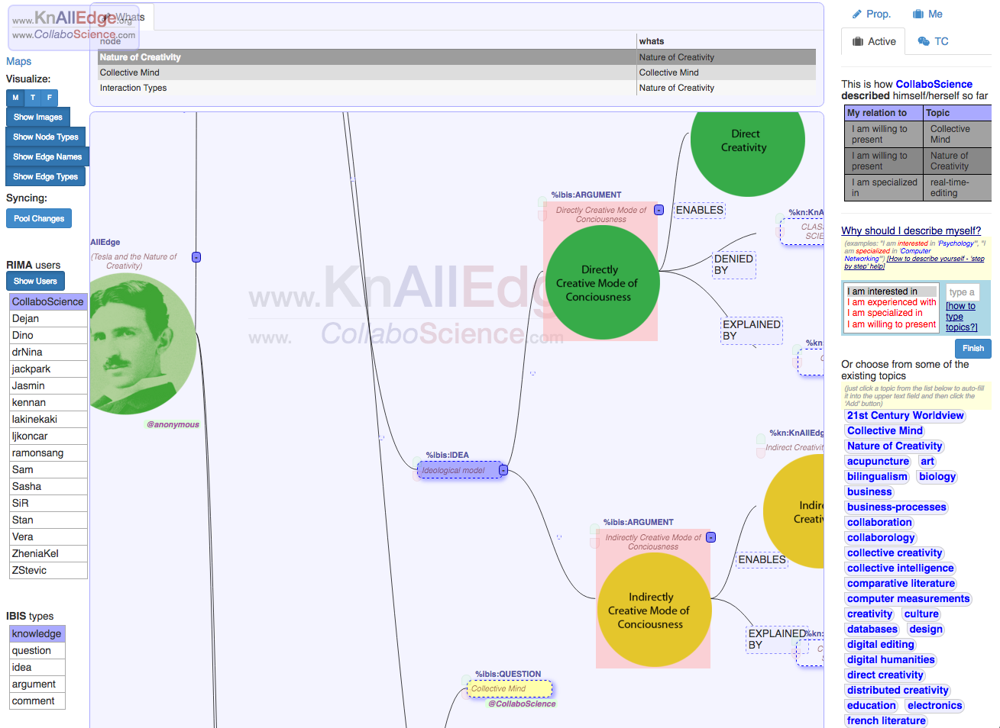
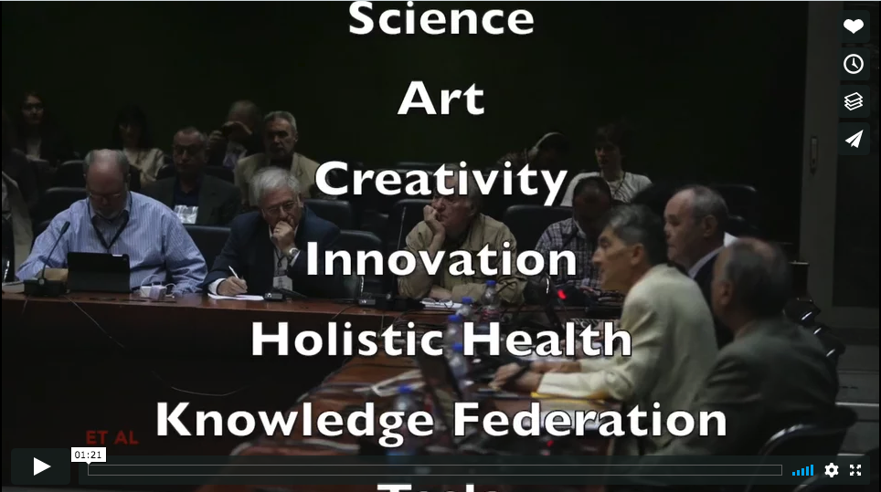
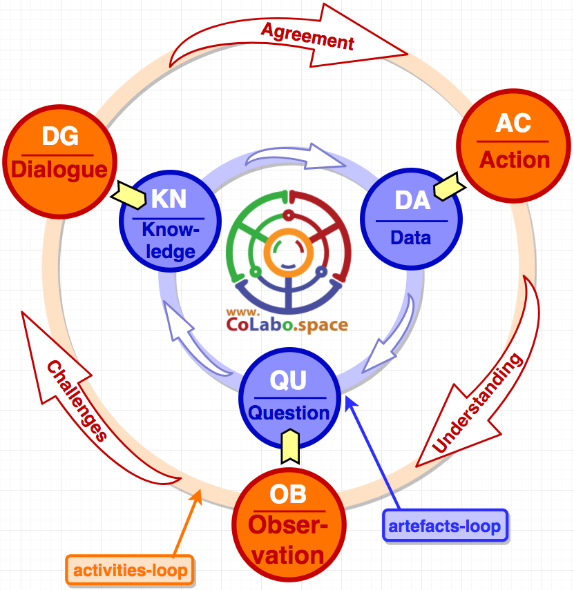

# CoLabo.space

CoLabo is a socio-technical ecosystem for collaboration. It is an augmentation of a collective mind.

It consists of the set of principles, socio-technical methodologies and online tools for supporting efficient collective collaboration. Among others aspects (spaces), it is aiming providing knowledge space, together with action space and dialogical space coexisting in one ecosystem.

Colabo.space is not an ultimate solution for the collective mind, it is an enabler of the collective mind, it is a bootstrapping solution which aim is to help community (, society, humanity) to co-evolve as an socio-technical entity.

***Figure colabo-methodologies***: Colabo Methodologies 

***Figure tools***: Colabo Tools

It is research, artistic and proactive co-effort for enabling collective mind.

**Figure colabo-example**: An Colabo example - Modeling the round-table dialogue on the topic of the Tesla's Nature of Creativity at the Tesla Conference (2015/2017)

For more details see the video:

# Motivation

Some of the main motivations behind developing CoLabo are the following:

* support of collective "knowledge-gardening" (thanks to Jack Park for the term)
* create a semantic-agnostic knowledge model
* create a universal knowledge layer with zero-friction between SoA system components
* create extendable knowledge semantics
* support dialogical process of knowledge creation
* support multi-truth knowledge
* support fuzzy-knowledge
* support personalized knowledge

An outmost goal was succeeding in development of the collaborative-system with unobtrusive and continuous **knowledge-dialogue-decision-action-learn** cycle:

***Figure Colabo-spiral***: Colabo-spiral of sustainable Collective Mind
