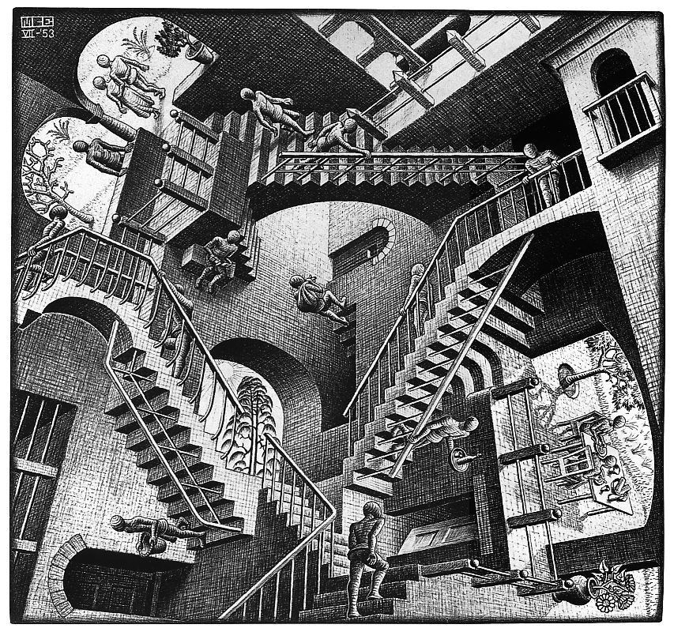
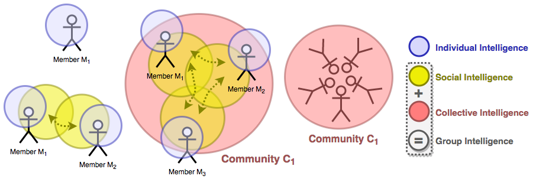
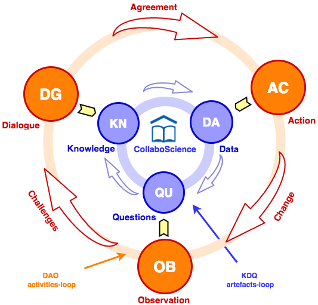
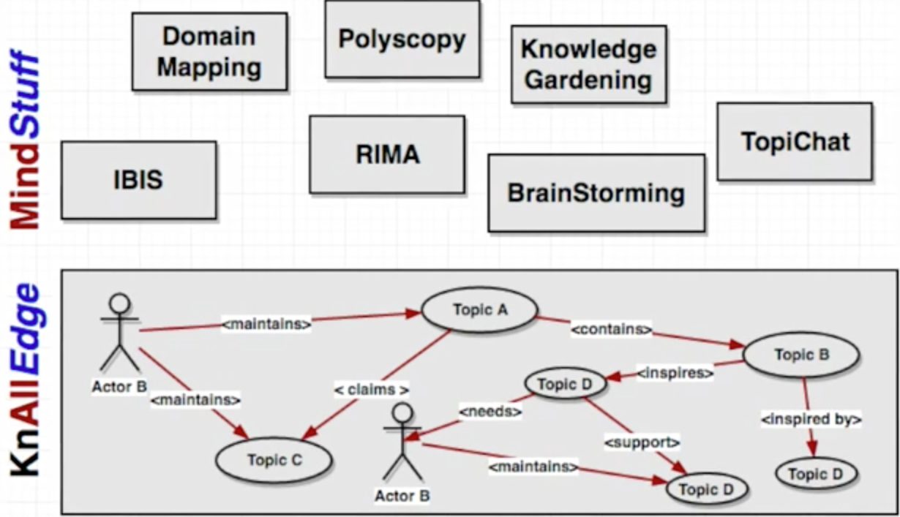
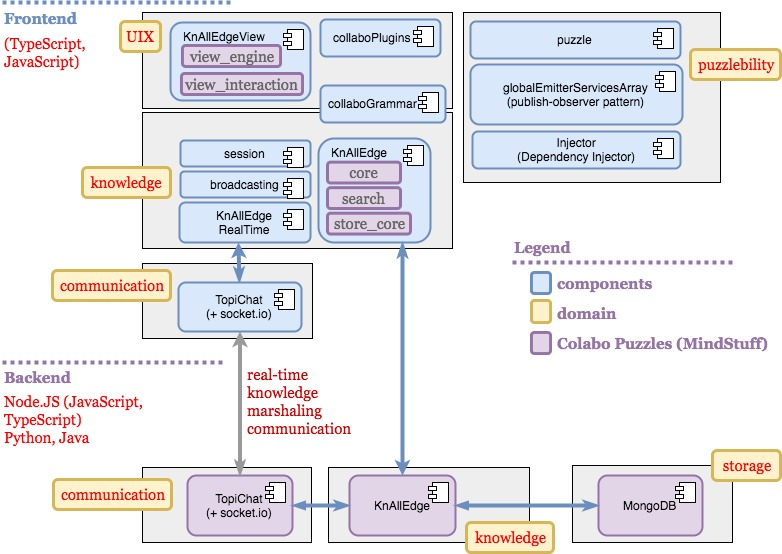
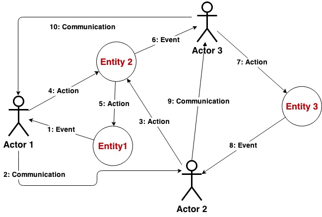
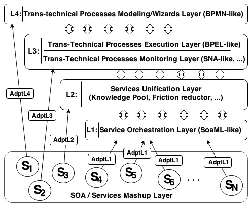
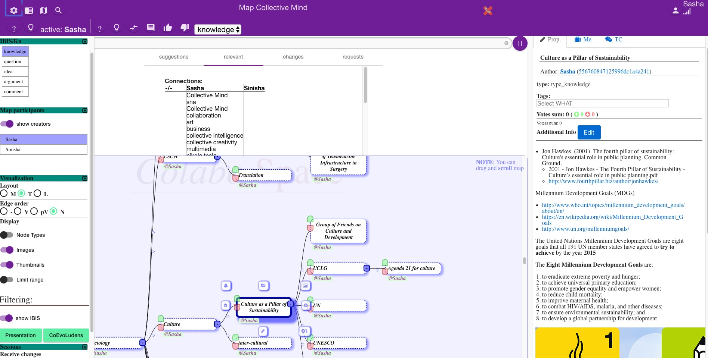
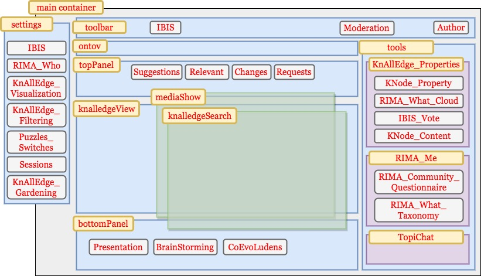

***Figure escher-relativity-lattice***: M.C. Escher - Relativity lattice (1953)

# Colabo.Space - An Ecosystem of The Collective Mind

**Figure KnAllEdge-map-example**: KnAllEdge Map example - Modeling the open table dialogue on the topic of the Tesla's Nature of Creativity at the Tesla Conference (2015)

## Colabo.Space Manifesto

1. **Self-evolving collective mind**
2. **A cycle of sustainability is a spiral of thrivability (dialogue, social domains)**
3. **Individual in collective (multiview, polyscopy)**
4. **Social and collective intelligence**
5. **Creativity and innovation**
6. **Dialogical science**
7. **Fuzzy systems - knowledge, flows, and UIX**
8. **Homogeneous heterogeneity**
9. **Tools incremental improving of collective mind**
10. **Co-evolution**

***Figure intelligence-types***: Types of intelligence and their relationships across individuals and community

An outmost goal was succeeding in development of the collaborative-system with unobtrusive and continuous **knowledge-dialogue-decision-action-learn** cycle:

**Figure 2**: CollaboScience spiral

KnAllEdge is inspired with __ISO__ standard (ISO/IEC 13250:2003) of Mind-maps: **Topic maps** (@see on [Wikipedia]{@link https://en.wikipedia.org/wiki/Topic_Maps}) and __SocioTM__ (please @see [abstract]{@link http://tmra.de/2008/talks/socioTM-relevancies-collaboration-and-socio-knowledge-in-topic-maps.html} and [paper]{@link http://tmra.de/2008/talks/pdf/309-323.pdf}).

***Figure mindstuff***: MindStuff - a conceptual "metaphor" of tools for incremental evolution of the collective mind

***MindStuff*** (End-user tools) are realized through the composition of the basic building blocks; for example ***IBIS*** and ***Presentation*** MindStuff are realized as a composition of KnAllEdge and ColaboGrammar, while the ***CoEvoLudens*** methodology is realized as a composition of ColaboFlow, KnAllEdge, RIMA, and ColaboFramework. Some of the MindStuff we will discuss in the following sections.

***Figure colabo-core-set***: 3rd party libraries **stack** for the core of the Colabo.Space ecosystem

At the (*fig. colabo-core-set*) a reader can find

***Figure colabo-components***: Colabo.Space components and puzzles

## ColaboFramework Architecture

In this section, we will discuss more on the foundations of the ColaboFramework architecture. ColaboFramework is a modular infrastructure, following the principles of Model Driven Architecture (MDA) (Brambilla, 2012). Although conceptually conforming with MDA, our approach is more focused on the human side of knowledge workers, self-evolving systems and fuzziness among others. Therefore, it is more correct to say that it follows the Collective Mind (Colabo) Manifesto, but conforming to MDA principles at the same time. Our architecture proposal we call Trans-Domain System Layered Architecture (TDS-LA).

### Introduction to TDS and TDS-LA [^tds-la-source]

We introduce ***Trans-Domain Systems (TDS)*** as a possible evolutionary step beyond Socio-Technical Systems (STS), modeled through socio-technical theory (Trist, 1981) that attempts to map the complexity of a regular technical system and the necessary reference to the social component present in any technical system.

The model/theory of the Trans-Domain systems brings some important extensions to the socio-technical model.

First of all, TDS clarifies terminology and processes that constitute the use of the system. Therefore, we introduce the notion of the **Trans-Domain Process (TDP)** (*fig. TDP*) as a process that describes user usage of the system and represents, from the user's perspective, the unit of work that could bring benefits back to the user and be recognized as a rounded off/complete system interaction.

 

**Figure TDP**. A generic example of a Trans-Domain process (TDP)

TDPs are further split and described with **Trans-Domain Activities (TDA)** that represent the minimal possible interaction between the user and the TDS; *an interaction quant*. TDPs include diverse classes of TDAs: economic, entrepreneurial, business, management, environmental, humanistic, and geo activities, among others. The extension of activities is an important extension of socio-technical systems. The concepts of the TDP and the TDA strongly relate to social interaction processes (Taveter, 2001).

TDSs are systems where TDPs and TDAs are the *first-level-citizens*. Having introduced TDSs, we can now proceed to present TDS-LA.

The types of TDS we focus on in this research are mostly mashups and highly heterogeneous, loosely orchestrated (distributed, collaborative, and multi-vendor) trans-domain systems. There are at least two reasons why these systems are our main focus. First, they are the present and most likely the future of complex online systems. Secondly, we believe that these systems, having been part of CSCW (Computer-supported cooperative work)/Groupware for many decades (starting with the legendary Douglas Engelbart’s vision and his famous presentation “The Mother of All Demos”), are key changers in complex society issues today and one of the strongest candidates when it comes to helping solve global wicked problems.

***Trans-Domain System Layered Architecture (TDS-LA)*** is our proposed architecture designed to provide real-time, located and dislocated infrastructure for collaboration. At the same time, our research question is how to design an infrastructure that will help the augmentation of the collective mind by motivating and engaging community. The intended result of this work is to increase the collective-mind outcome, personalizing it for each community member and orchestrating the interactions between community members.

The set of relevant layers of the TDS-LA system is presented in the (*fig. TDS-LA*).

**Figure TDS-LA: ** Trans-Domain System Layered Architecture

A short overview (TL;DR;) — L1, L2, <c ?>and adapters</c> are necessary in the case of a heterogeneous system that bridges multiple vendors with different implementations of the underlying structure of the Collective Mind system. L2 is a layer that provides collective knowledge, L3-L4 cares about trans-domain processes between collective mind actors. L3-L4 observes, learns and orchestrates community member interactions. They help capture user actions inside the system in a form similar to (*fig. tdp*). This representation is reminiscent of the UML Communication diagram [^uml].

The most promising initiative so far that aligns with our architecture is a stack of Business Processes (BP) Languages (BPEL, BPMN, BPEL4People) and some bridging support (namely, BPEL and Java) supported with underlying orchestration and architecture modeling stack, like SoaML.

If we continue to make parallels between BP (Business Process) and TDP (Trans-Domain Process), then our first focus is on mapping business processes onto the domain of trans-domain systems, and recognizing BPMN-like modeling language as ***the-programming-in-large*** modeling language (DeRemer, F., & Kron, H. H., 1976) of the trans-domain systems.

To provide a unified and homogeneous picture of the highly heterogeneous (many-vendors/technologies/protocol/AAA...) underlying systems, we introduce the Service Unification Layer that provides unified-system support for higher layers, but also provides the end-user with a unified knowledge model and low-frictions usage of trans-domain systems.

Finally, to make everything feasible, at the bottom of the TDS-LA we have the Service Orchestration Layer with the SoaML modeling language to link all the components of the TDS and describe their functionality, but also their dependencies and message flows between them.

Concluding notes on the TDS-LA would be that it is a proactive socio-technical system consisting of both human and autonomous agents that, together, create a complex socio-technical setting with demanding moral and ethical requirements put on the collective mind stakeholders; community members (human actors); autonomous actors (TDS-LA optimizing components); domain experts that design system behavior; and TDS-LA designers behind its infrastructure and its "*laws of physics*".

At the following figure (*fig. TDS-stack*), the reader can see a stack of different artifacts and constituents at each business layer of the TDS system.

**Figure TDS-stack:** trans-domain System Stack

### ColaboFramework

It is relatively difficult to put hard boundaries around the ***ColaboFramework (CF)*** and describe it precisely, but we will try to do our best. The problem comes from the deffiniton of the ColaboFramework and its distinction from the Colabo.Space ecosystem. Similarly it is hard to distinguish it from MindStuff (Colabo.Space Puzzles).

> If Colabo.Space ecosystem is an instance/prototype of the Collective Mind, then ColaboFramework is an instance/prototype of TDS-LA,
> ​	it is an infrastructure of the Collective Mind.

However, same as Colabo.Space ecosystem consists of Colabo puzzles in a same way ColaboFramework (***CF***) consists of them - it itself is designed following the same principles. Therefore we have Colabo Puzzles that are constituting parts of the CF tool: like Session, Broadcasting, KnAllEdge property, KnAllEdge content, IBIS, etc. On the other hand, some Colabo.Space tools are also constituting parts of the CF: like KnAllEdge and RIMA tools - they are basically a fundamental part of the Collective Mind infrastructure (*fig. CF-example*)

**Figure CF-example**: ColaboFramework real example snapshot of the Collective Mind map

In other words, we would like to see the CF as its name suggests (*Colabo**Framework***) - a *framework for collaboration* - or a collective mind framework. Therefore our design principle is that a community designer or developer will take a CF as a framework to build community designated collective mind. In that way it contain all fundamental components. Still, CF is highly adjustable - all its puzzles or even tools are not existential part of the CF - the system doesn't have a hard dependency on them, it can be built without them, and even KnAllEdge tool is built as many puzzles. In that way, someone can develop a very narrow and specialized community collective mind, focusing only on one aspect, or develop an light app that will support just particular practice of the community or collective mind, for example, just let members to search for KnAllEdge artifacts, or just provide IBIS interaction with them - they are covered due to CF (and Colabo.Space) systems granularity. To adjustify this with more detailed example we show at the (*fig. CF-visual-components*) a detailed scheme of all separable components of the CF main view presented at the (*fig. CF-example*).

**Figure CF-visual-components**: ColaboFramework - Visual Components, Puzzles, Pannels