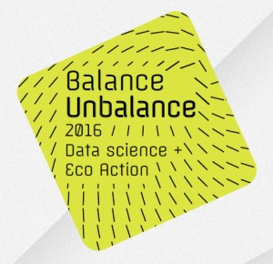

# CollaboFramework
## (CollaboScience + CollaboArte)

[Register for the BunB'16 workshop](http://knalledge.org/prod/#/register/route/whoAmI___0route___0map___1id___15732ba0d051e2f6f47c6558f___1route___1http%3A___2___2knalledge.org___2bunb-registered.html)

[BunB'16 Map with login](http://knalledge.org/prod/#/login/route/map___0id___05732ba0d051e2f6f47c6558f)

[BunB'16 Map](http://knalledge.org/prod/#/map/id/5732ba0d051e2f6f47c6558f)

This workshop is a **real-time practice** of collaboration between scientists and artists addressing the ecologycal problems of drilling oil in the [Yasuni National Park](https://en.wikipedia.org/wiki/Yasuni_National_Park), Ecuador. The workshop is supported by collaborative augmenting platform CollaboFramework, a collaborative system with unobtrusive and continuous **knowledge-dialogue-decision-action-learn** loop:

CollaboFramework is an umbrella platform for [CollaboScience](http://www.CollaboScience.com) and [CollaboArte](http://www.CollaboArte.com) that are both in their own ways connecting worlds of Science, Art, Humanities and audience.

CollaboFramework aims to provide a ***Collective Mind*** (concepts pionireed with Douglas C. Engelbart and Warner Bush) of society and augments capabilities of solving ***Wicked Problems***.

CollaboFramework creates an active dialogue arena for the ***Community of Interese*** (CoI) - in this case a CoI dealing with the ecologycal problem in the Yasuni National Park.

As a workshop participant, you will have a chance to ***participate in the real-time collaboration*** and contribute creating scientific and artistic artefacts and be part of knowledge gardening process.

The outcome of the workshop will be used in the ***post-event period*** which will serve as an creative space for inspiration and motivation of artists. In that space artists will have a chance to create engaged and programatic artistic pieces.

In order to fully participate in the workshop, you need to ***register*** in CollaboFramework and ***describe*** yourself through your interests in order to help the system to match your expertises and interests with other participants and integrate you with knowledge gardening process.

[Register for the BunB'16 workshop](http://knalledge.org/prod/#/register/route/whoAmI___0route___0map___1id___15732ba0d051e2f6f47c6558f___1route___1http%3A___2___2knalledge.org___2bunb-registered.html)

-----

Some of the main motivations behind developing CollaboFramework are the following:

* support of collective "knowledge-gardening" (thanks to Jack Park for the term)
* support for psycho-sociological and mediation patterns of knowledge gardening
* create a semantic-agnostic knowledge model
* create a universal knowledge layer with zero-friction between SoA system components
* create extendable knowledge semantics
* support dialogical process of knowledge creation
* support multi-truth knowledge
* support fuzzy-knowledge
* support personalized knowledge
