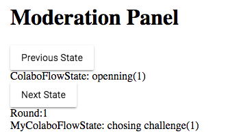

# PSC

## Register/Login

## Select SDG(s)

not needed for CWCs testing

## Create CWCs

Coaching with Compassion / Dreams/ Visions

- create 5 CWCs

## Performative DialoGame

- **Moderation Panel**
  - we have to set before that the correct state by precious next to set up opening state
  - 
- **Playing**
  - in **My response** we can see the current move being played
  - we choose one of the 17 suggested SDG cards 
    "Start the dialogue by choosing a question that the dreaming you've done might answer on
    Click the one you want to reply on"
    
  - then we select some of the suggested respond cards, made out of our CWCs 
    "Your turn to play!
    These are your cards to respond
    Click the one you want to play"
    
  - 
  - 
  - 
  - 
  - 
  - now the player is "blocked" at the end of the first round, waiting for the moderator to change the round to the 2nd, when the player's system would automatically initiate new round and show the suggested cards to the player to play on them
  - **moderator**
    -  waits  to see that all the players have played the first round
    - when all have played, he press the button to **request similarity suggestion**
    - when all the suggestions have received, moderator press the button **next state** - it inits the new round as stated above
    - 