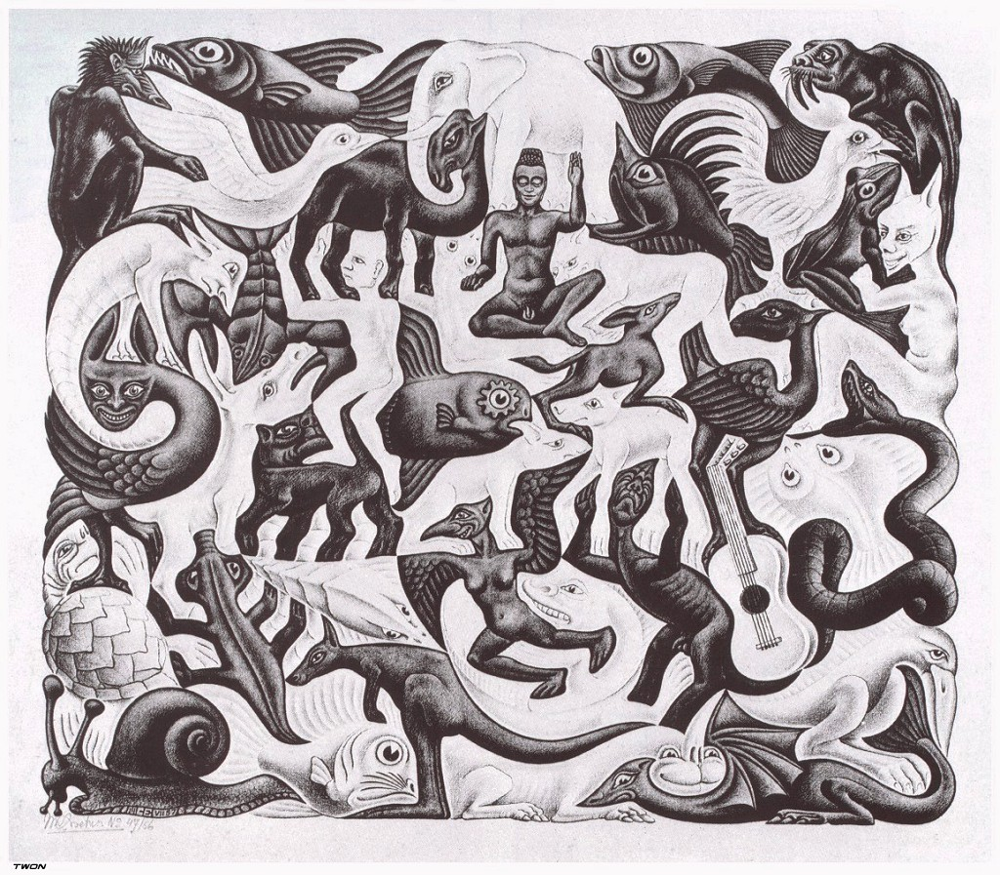

***Figure Escher-Mosaic-II***: M.C. Escher - Mosaic II (1957)

# KnAllEdge - Collective Memory

At the (*fig. KnAllEdge-frontend-classes*) we see a whole diagram of KnAllEdge related classes; core (KnAllEdge), Angular UI specific (*KnalledgeMap directives*), Angular Services and vanilla objects (*KnalledgeMap services*), and user interaction classes (*Interaction*)

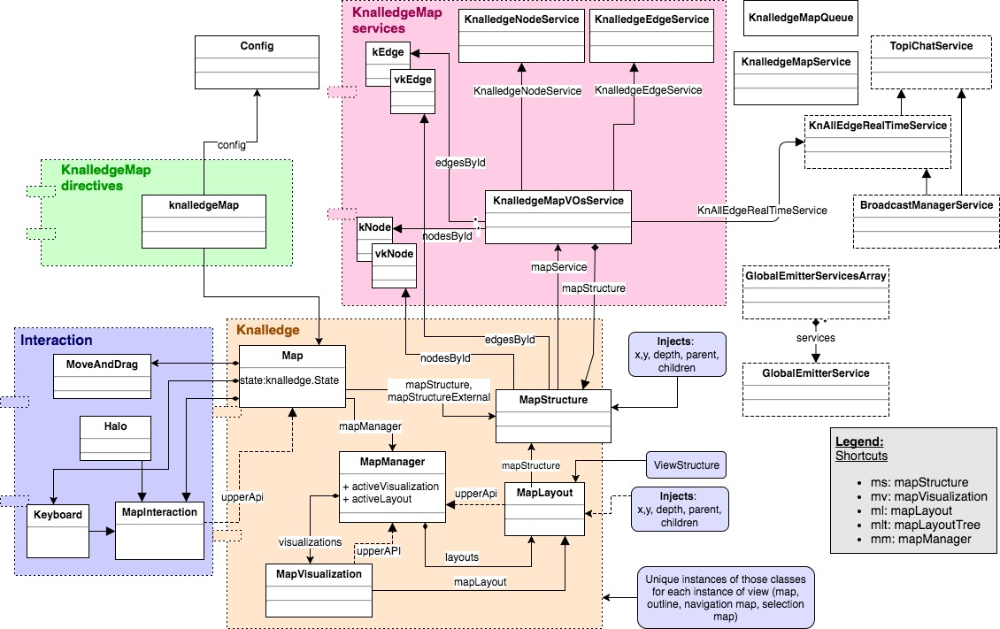

***Figure KnAllEdge-frontend-classes:*** A hierarchy of KnAllEdge frontend classes, core, storage and interaction

# General Discussion

Continuing the discussion of the chapter entitled "Collective Mind Historical Introduction", we are back to the Memex and Codiac systems. Apart from the introduction of associations, as the most important explicit concept introduced in the *memex*, this included more important paradigm shifts. One of them was a ***mechanism of sharing relationship***/associational (topic-maps-like) knowledge. The mechanism is automatized, transferable, with the possibility to merge the created associational knowledge with other sources of similar knowledge Although in its "rural" technological perspective it had no claim to a real potential for making a paradigm shift, it did offer a foundation for forthcoming inventors.

At the same time, associational knowledge provided a first prototype of the collective mind, a way of encoding thoughts, knowledge and assumptions into an externalized content of a "***trail***", that another person could import into her own *memex* to recall knowledge created by the person who first encoded it. This was another powerful idea, which presented a concept of a more semantic form of externalizing knowledge than regular written texts. In the same paper, Bush discusses, in the context of  the *vocoder* and *stentotype* machines, the fitness and effectiveness of natural language in terms of recording and translating voice into text and producing knowledge. In a sense, this seems to be a call for developing a semantic language for encoding natural language, one which would help even more in building more semantically explicit trails.

Bush also voices the idea of multiple references to a single knowledge item - " *It is more than this, for any item can be joined into numerous trails*". He also brings the notion of ***knowledge reuse*** and that of implicitly attacking the problem of ***knowledge redundancy***. Thus, he solves the problem of replicating and reusing knowledge entities into different higher levels of knowledge construction ("*… gathered together from widely separated sources and bound together to form a new book.*"), which in turn opens the opportunity of building specialized knowledge presentations of fundamentally the same knowledge - imagine different books written on the same topics of mathematics algebra with most of the same axioms and theorems but introduced and ordered differently. Having the chance of forming and shaping different books implies that they can be organized to provide different teaching formats - linear, spiral, deep-first, width-first, etc.

More generally, Bush's concept of memex introduces the 2 most important aspects of this chapter -  collective knowledge/memory and knowledge liberation.

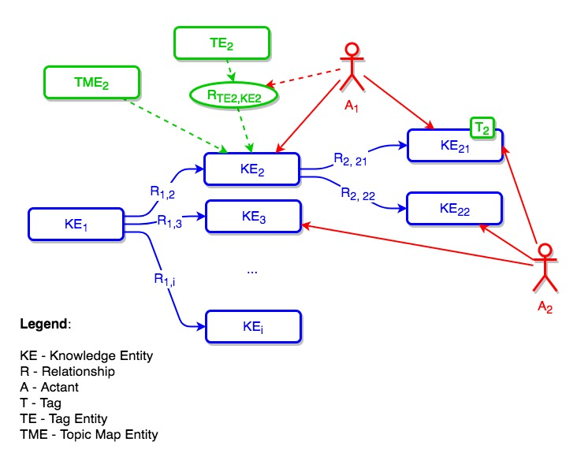

***Figure knalledge-entities-example***: Knowledge Pool Entities - Example

Regarding ***knowledge liberation*** - there are many ways, in which knowledge and information in general is not free, and we will discuss them in the following sub-sections.

**FORMAT** - most systems still rigidly dictate knowledge formats as most of them have some structured knowledge storage underneath, like SQL databases, etc. The big-data trend and NoSQL databases (Bakshi, K. 2012) did help with the liberalization of formats and let system designers change data schemes much easier (even during the run-time), or support different versions of data schemes in parallel. However, at the top level as well as at the user level, most systems do not let users change the data representation and keep to the same hardcoded data interaction and visualization.

**SEMANTIC** - if users have the possibility to semantically annotate knowledge entities or interrelate them, there are usually strict semantics that a user has to follow - a user cannot create her own semantic annotation, or supplement one annotation with another one, or else introduce hierarchical relations between knowledge entities if they are not recognized by the system; a user is not capable, for example, of introducing a semantical relationship between topics TME~2~ and KE~2~. Similarly, users cannot introduce new forms of semantic annotations. For example, let us assume that our system supports tagging (KE~21~ is tagged with T~2~). Now let us imagine that a new prospect community cares about ***personal tagging*** - authorship of the tag, or wants to have personalized tag-clouds. In this scenario, the community is not able to introduce a separate Tag Entity TE~2~ and its association with the KE~21~ annotate with the authorship (A~1~).

**PERSONALIZATION** - personalization does not only address the problem of providing personalized knowledge information and experience through personalized features, but also ***personalized knowledge structures*** (Nürnberg, 2003). Knowledge structure is of fundamental importance for modern free forms of creative knowledge where freedom of expression is a key factor for avoiding creativity inhibition. However Nürnberg (2003), reflecting the majority of knowledge management approaches to system design and research, continues: "*… a personal knowledge object can only exist in a personal structural object and not in original structural object*". In collective memory, this would most likely be a fatal approach, especially considering semantic and technical implementation that brings strict separation of *personal* and '*original*' (global).

Collective memory needs to provide transparency and continuous transition between the personal and the collective. In that sense, knowledge constructs should never be semantically or technically separated into special categories; rather, we should introduce continuous transition between the states (see further under *fuzziness*).

Another important mis-design of the knowledge systems comes with the separation of knowledge entities, knowledge structure and meta-data into separate categories (*fig. nurnberg-knowledge-personalization*)

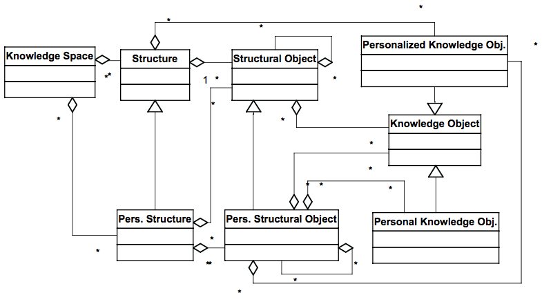

**Figure nurnberg-knowledge-personalization**: Figure 10. from the (Nürnberg, 2003) showing UML-diagram of the knowledge personalization

This immediately disables any opportunity of migrating taxonomical meta-data into knowledge structure, etc. - consider the aforementioned example of tagging with an annotated tag or separate tag-topics under the topic *semantic* relating to *fig. knalledge-entities-example*. Eventually, this increases the entrance price for prospective community members, introduces knowledge management friction, and requires the community to practice a translation process [REF: CSCW translation theory] between the inside understanding of the knowledge space and the actual knowledge space provided by the system.

**FUZZINESS** - knowledge as a term might be misleading when it comes to the certainty aspect and it is often confused with *facts*. In reality, very often knowledge entities might be merely assumptions that incrementally converge towards more accurate *factual knowledge*. Another scenario would be fuzziness of meta-data, for example tags should not be merely "*fully*" attached to a KE, but should rather be assigned a weight according to their relevance either in terms of general knowledge, or on a personal basis.

## Transdiscipline

KnAllEdge component addresses the problem of transdisciplinarity and multi-truth. A well known approach in addressing trans-domain topics is a notion of boundary objects (Star & Griesemer, 1989) presented at (*fig. boundary-objects-topics*) and with KnAllEdge implementation details at the (*fig. boundary-objects-topics-detailed*)

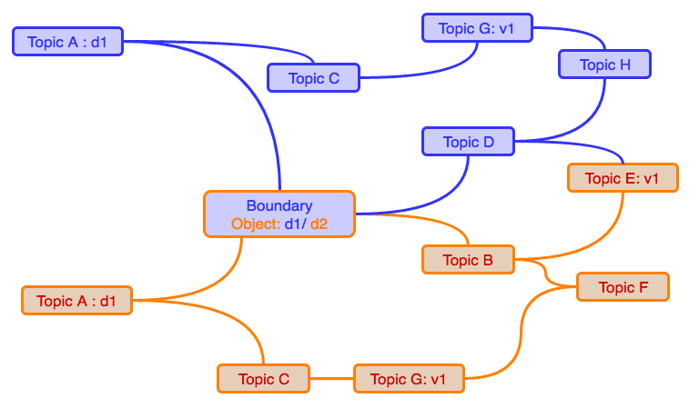

**Figure boundary-objects-topics**: Boundary objects

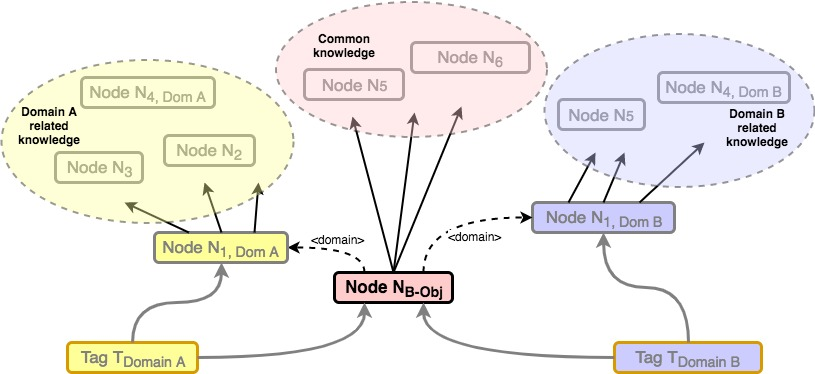

**Figure boundary-objects-topics-detailed**: Boundary objects in detail

## Dialogical science

Understanding the importance of dialogue expressed with D. Bohm’s work (Bohm, 2013), we extend the very definition of dialogue:

> ***Dialogue*** is any form of interaction between two or more *actants* through any means of information exchange processes most likely resulting in the production of new *knowledge* (either external or within the actants' personal domain) and call for *action* (*fig. colabo-dialogue*).

***Figure colabo-dialogue***: `"ColaboDialogue" - a transformational nucleus of any change in collective mind. D = Dialogue, A=Actant, AC=Action, KN=Knowledge (KnAllEdge)

> **NOTE**: Authors have deliberately chosen the term ***actant*** over the term member/actor. The preference for 'actant' comes from the Actor-Network Theory (Law, 1984) where the complex fabric of socio-technical systems is constructed by the network of actants whether they are human actors or smart agents or barely technical components (either computer system components, or tools like pencil, paper, etc.).
>
> In the bigger picture, this gives credibility to human-machine dialogue, but also guidance and responsibilities for developing dialogical cyber-infrastructure.

Further, created knowledge will serve as a trigger for another dialogue, question or action. Similarly, actions will perform perceivable changes either in the dialogical or knowledge arena or in the domain of actants' interest.

With this extension of the notion of dialogue, there is an obvious extension of the dialogue application, which brings more possibility for applying a dialogical approach to solving complex problems. On the other hand, there is an even more important possibility for the transformation of the very socio-technical cyber infrastructure used for augmenting collaborative and transdisciplinary dialogue that aims for solving complex problems. One of these complex problems we participated in with the approach we are describing here is described in the chapter "*Prototyping and Mediating self-organization*" under the section "*BunB - Yasuni Park - Brainstorming - Dialogical Science*".

Namely, inheriting the semiotic essence of dialogue, dialogue brings us ***continuous change***, support for ***evolutional*** rather then *revolutional change*, or in other words, a mechanism for non-intrusive but constructive changes. It assumes a ***multi-opinionated dialogic space*** with the purpose of suspending reduction the *unipolar-world space*, but rather communicating opinions across the knowledge-dialogue space and incrementally *"tweaking"* and adjusting actants' opinions. Dialogue helps develop a common space of knowledge and understanding and eventually leads to acceptance of common truth/decision or in understanding of each interest-party's position and compromise across different parties eventually evolving in a ***multi-truth*** scenario with a clearer understanding of different opinions, costs, and interests.

In that way, we can say that dialogue is a mechanism that preserves ***sustainability*** through the transformation of an unbalanced system back to a balanced system. If we accept the *need-for-balancing* as a system state rather than as an *exception-for-special-handling-and-additional-care*, we are able to recognize the power of embracing dialogue at the systemic level.

On the other hand, from the real-world practicing perspective, dialogue is a sequence of events that in the real life requires noticeable discussion break and discussion recovery (considering time interruptions, switching contexts, narrators, … This is a reason for supporting dialogue with methodologies and augmenting it with socio-technical systems. One example of dialogical methodologies is IBIS (Issue Based Information System) (Conklin, 2003), which introduces clear **rules** for moderating dialogue and building understanding of the domain. Similarly, “*6 thinking hats*” (De Bono, 2009) presents a psycho-sociological intervention in governing dialogue and represented knowledge production, etc.

We should mention here DebateGraph system [^debategraph], the IBIS decision making system for complex issues. Through our initial practice and experience with the DebateGraph we got initially inspired for this manifesto item (dialogical science) through the process of extending the DebateGraph mechanics.

One important aspect of the extended dialog definition (*fig. colabo-dialogue*) is the capacity for dialogical intervention through knowledge changes and actions — ***reflective and proactive mechanisms*** of dialogue — to balance the unbalanced. Unfortunately, the majority of technologies used to support dialogue (including IBIS systems), lack the possibility of automatic and continuous extrapolation of dialogical outcomes — interpreting dialogical results and intervening either in the knowledge space or in the real-world domain — in other words, the sustainability-loop of change is broken (*fig. colabo-spiral*).

Therefore, we propose ***ColaboDialogue*** - a concept that unites all three spaces (dimensions): dialogical, knowledge and action spaces into a single and continuous space where interactions across domains are natural, fluent, frictionless, and coexisting (*fig. colabo-dialogue-conceptual*). In essence, the main or rather the most solid and long-term dimension is the knowledge dimension, which is continuously evolving — it represents the collective memory of the collective mind. The aim of each community is to evolve its collective memory. That evolution can run solely across the knowledge dimension, but it can be supported by expansions in other dimensions. These expansions (based on their nature, evolution and life-time) we call ***bubbles***.

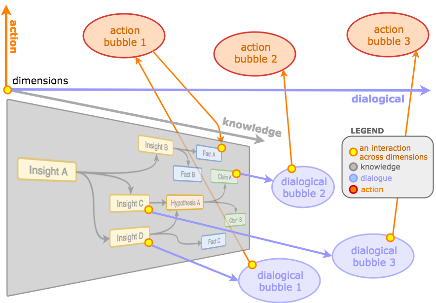

***Figure colabo-dialogue-conceptual***: A conceptual view on the three dimensions of ColaboDialogue

***Dialogical bubble*** bubbles out as a need to discuss an issue in the knowledge space (i.e. Insight D → dialogical bubble 1), but at the same tame they are reflective to the knowledge space as can be seen on the more detailed diagram (*fig. colabo-dialogue-detailed*). In that way, the dialogical bubble *lives* in a separate dimension, and does not pollute the knowledge space. At the same time, it is strongly coupled with that space and can support, change and reflect the knowledge artifacts (Insight D, Claim A, …). After a period of time, the dialogue in the bubble ***matures*** and it can be considered as "*resolved*". In that way, following the real-world and social model of artifact life-time, it "***fades-out***" and stays available only as argumentation for a particular knowledge decision and to avoid "*knowledge-wars*".

On the other hand, a dialogue provokes (real-world) actions and creation of an ***action bubble*** (i.e. Question 1 → Action 1). However, an action result can affect the knowledge space (Action 3 → Fact 3) or the (original) dialogical bubble (Action 2.2 → Idea 2). In this way, actions introduce changes into the system and provide new information that calls to be processed and understood. This can go the whole way back to a call-for-dialogue for “plumbing” and evolving the original knowledge space.

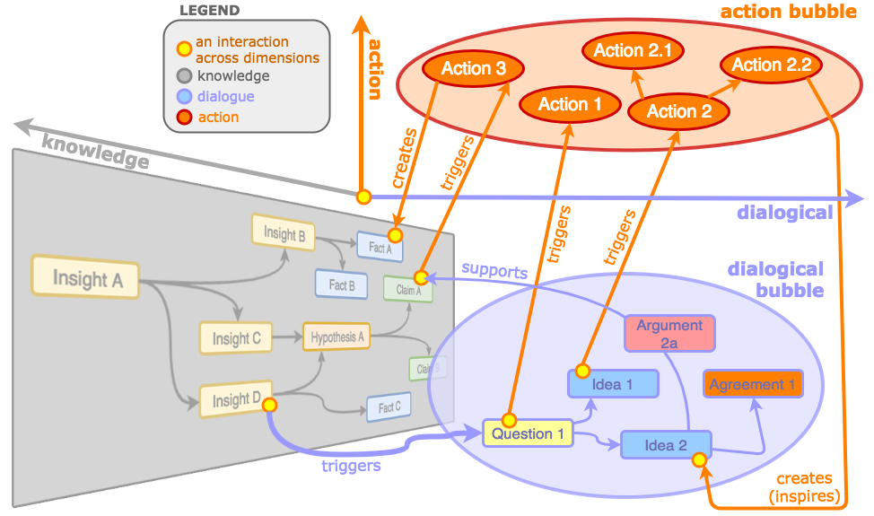

***Figure colabo-dialogue-detailed***: A detailed view of three dimensions of the ColaboDialogue - an example of the dialogical and action bubble 1

As a result, dialogue does not "*hang in the air,*" but reflects back and transforms knowledge and potentially neutralizes the tension or open question (in the knowledge space) that initiated the dialogue at the first place. We can say that dialogue performs ***healing support*** for knowledge management.

> *… no two people think alike, "quot homines, tot sententiae" … A World Encyclopaedia as I conceive it would bring together into close juxtaposition and under critical scrutiny many apparently conflicting systems of statement. It might act not merely as an assembly of fact and statement, but as an organ of adjustment and adjudication, a clearing house of misunderstandings*
>
> — H.G. Wells thoughts of World Encyclopedia (World Brain)

## IBIS (Issue Based Information System)

### Conceptual difference from standard implementations of IBIS

The **IBIS module** is implemented on top of KnAllEdge and differs from the standard implementation of IBIS (Conklin & Begeman, 1987).

Our initial experience with the IBIS-related systems was mainly through the use of the DebateGraph system [^debategraph]. DebateGraph is a powerful online, real-time interactive deliberation and decision-making system (Gatautis, Stravinskiene, & Gudauskas, 2011), (Wyner, & Van Enger, 2010), (Fox, Hazlewood & Elson, 2014). While it does offer a reliable, robust and complete tool for deliberation, we have decided to diverge from its design principles into a more generic infrastructure with a focus on collaboration.

The main reason for diverging from the original IBIS implementation is that the original IBIS system(s) are designed as standalone systems that provide dialogue mapping. However, Colabo.Space ecosystem promotes frictionless services integration and knowledge sharing across services.

The fundamental problem with most standard IBIS implementations is that, although they were intended to support ***dialogue mapping*** around different topic of interests in a community, the process of argumentative dialogue necessarily introduces new knowledge artifacts which transform a semantically clean IBIS space into a space that is cognitively ***polluted with knowledge***.

This, in addition to confusion at the **information level** (what is IBIS artifact and what is knowledge artifact), brings confusion at the level of **community procedures** (i.e. where to search for knowledge, or what the consensus is regarding some topic, etc.). It also introduces additional ***articulation work*** of managing knowledge products and migrating them from the IBIS environment (system) into a knowledge repository system, or updating the repository based on the agreed census.

Obviously, this is not the desired scenario, which brings us to our design decision of integrating IBIS differently in the Colabo.Space ecosystem.

First of all, IBIS loses its status as an information system, and becomes a *component* that deals with particular knowledge-transformation procedures.

Secondly, IBIS is integrated with regular knowledge, and represented with regular KnAllEdge artifacts. However, IBIS is still both ***semantically and procedurally isolated*** from regular knowledge. This means that we still have separate Colabo MindStuff (puzzle) component that semantically extends agnostic KnAllEdge space with IBIS semantic constructs and provides TDPts to operate within that space.

### Practices of using IBIS in KnAllEdge / Colabo.Space

Here, we present some of the more structured practices of using the IBIS puzzle inside the Colabo.Space ecosystem.

#### IBIS as a knowledge consensus mechanism

The clearest example is a scenario where knowledge workers do not have a consensus on a particular topic or lack sufficient insight on the topic.

In this scenario, a member of the community that recognizes a problem will "***burst***" an instance of dialogue mapped through the IBIS component, in order to address a particular topic of knowledge.

In that sense, discussion is orthogonal (isolated with unique semantic ***"%IBIS.*" namespace***) to the regular knowledge space. After consensus or the required level of insights is collected in the IBIS space, the insights/consensus are "***contracted back***" to (it updates back to) the knowledge-space.

This scenario directly corresponds to the Colabo Manifesto "*Dialogical science*" (chapter *Colabo.space - An Ecosystem for the Collective Mind*).

#### IBIS as knowledge multi(-truth/-opinion) polarization and argumentation

It is very often the case that some pieces of knowledge cannot be expressed either factually or uniquely, either due to *the very nature of the knowledge domain* (take for example religious issues, art, morality, etc.) or simply due to the conflicting opinions/attitudes of the knowledge workers (take the list of controversial issues on Wikipedia, the largest online encyclopedia, as an example: [Wikipedia:List of controversial issues](https://en.wikipedia.org/wiki/Wikipedia:List_of_controversial_issues)).

In these cases, IBIS serves as *a mechanism for polarizing and argumenting polarized knowledge(-workers') attitudes*. Through IBIS constructs, the community expresses opinions and attitudes regarding multiple knowledge truths and offers either a foundation for future knowledge explorers and consumers, or else a semantic footprint usable for smart filtering, matching and personalization of knowledge to personal profiles of future knowledge explorers.

In this scenario, it is clearly beneficial to ***leave*** the IBIS constructs to coexist with the corresponding knowledge (otherwise, an ***edit-war*** could occur - (Kittur et. al, 2007), (Sumi , & Yasseri, 2011)).

#### Dialogical process of knowledge production

Finally, we address scenarios where knowledge evolves and is produced through a dialogical process within the scope of IBIS.

In this scenario, knowledge workers discuss issues through the IBIS system and, through ideas and arguments, they build knowledge which is then encoded inside the IBIS space.

Therefore, Colabo.Space ecosystem and IBIS MindStuff make an effort to "***extract***" knowledge from the IBIS space. To achieve that, it also relaxes original IBIS ordering restrictions/rules and allows IBIS to intertwine with the regular knowledge space.

In practice, this means that IBIS artifacts (nodes) can be supported with regular KnAllEdge nodes, but it also means that IBIS ontology is relaxed as well:

1. ***IBIS questions*** can contain additional question nodes either in order to
   1. specialize or fine-grain the original question and help to answer it partially, or
   2. generalize the original question (which means that question-question relationship is allowed and directed (edge)), or else
   3. question the previous question (i.e. meta-dialogue about the need for the question at the first place)
2. ***IBIS ideas*** can generalize or specialize other ideas, whereby a claim is made in the same way as for IBIS questions.
3. Questions ***may question*** other Ideas and Arguments, providing ***recursion*** to the original IBIS model. This also helps to avoid ***negative socio-technical translation*** - for example, if users need to question an IBIS Idea and the system semantically forbids them, users might be tempted to still "*encode*" that social need in the context of wrong technical implementation (for example, prefixing the IBIS Argument with the text: "question", etc.)
4. ***IBIS Arguments*** can generalize or specialize other Arguments (the same reason as IBIS Questions and Ideas can do similar)

[TODO: provide additional illustrations of IBIS extensions or IBIS scenarios in general]

Still, other aspects of the IBIS grammar like "*Ideas can only respond to Questions*" "*Arguments can only support or object to Ideas*" are still in place to support structured dialogue and healthy progress of discussion.

[TODO: Figure this out: "At this moment, we do not practice automatic reasoning and therefore benefit more from relaxing the IBIS ontology and making it easier for users to express their statements and let us understand their needs, while trying to keep the basic structure necessary for ***structured dialogue mapping***."]

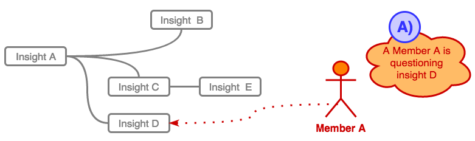

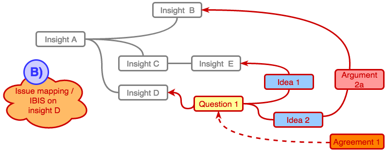

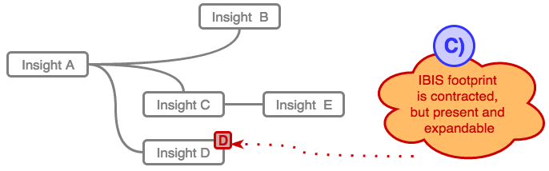

**Figure dialogical-knowledge-flow**: An example of a flow of dialogue augmenting knowledge

At the following diagram (*fig. KnAllEdge-createNode*) we see a process of **creating a new knowledge node**. There are few important aspects:

- multiple interaction entry-points - at the left side we see mouse, halo and keyboard as possible mechanisms of creating a new node
- real-time propagation - node creation is asynchrony propagated to the all other Colabo.System clients that are visualizing the same map/node
- multi-paths - we see that some parts of the activity diagram are initiated locally, some are coming from remote node manipulation, and some of actions are common
- system-wide notification - either change (node created) originates locally or remotely it

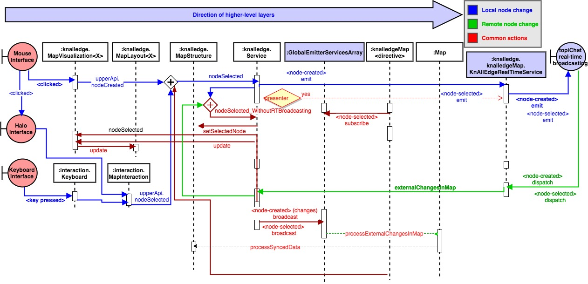

***Figure KnAllEdge-createNode:*** KnAllEdge ***createNode*** - interaction diagram

### Service

KnAllEdge service is implemented as a full JSON ***RESTful*** web service. It relies on and it is integrated with the ***WhoAmI*** service for user authentication and authorization, but it is fairly easy to integrate it with other user management components.

***NOTE***: Backend needs a special **express-resource** package on steroids. You can download it as a separate package [here]{@link http://magicheads.info/downloads/express-resource.zip}. After or even before issuing "**npm install**" you should (re)place the content of the archive into your  backend/node_modules folder.

Star, S. L., & Griesemer, J. R. (1989). Institutional ecology,translations' and boundary objects: Amateurs and professionals in Berkeley's Museum of Vertebrate Zoology, 1907-39. *Social studies of science*, *19*(3), 387-420.